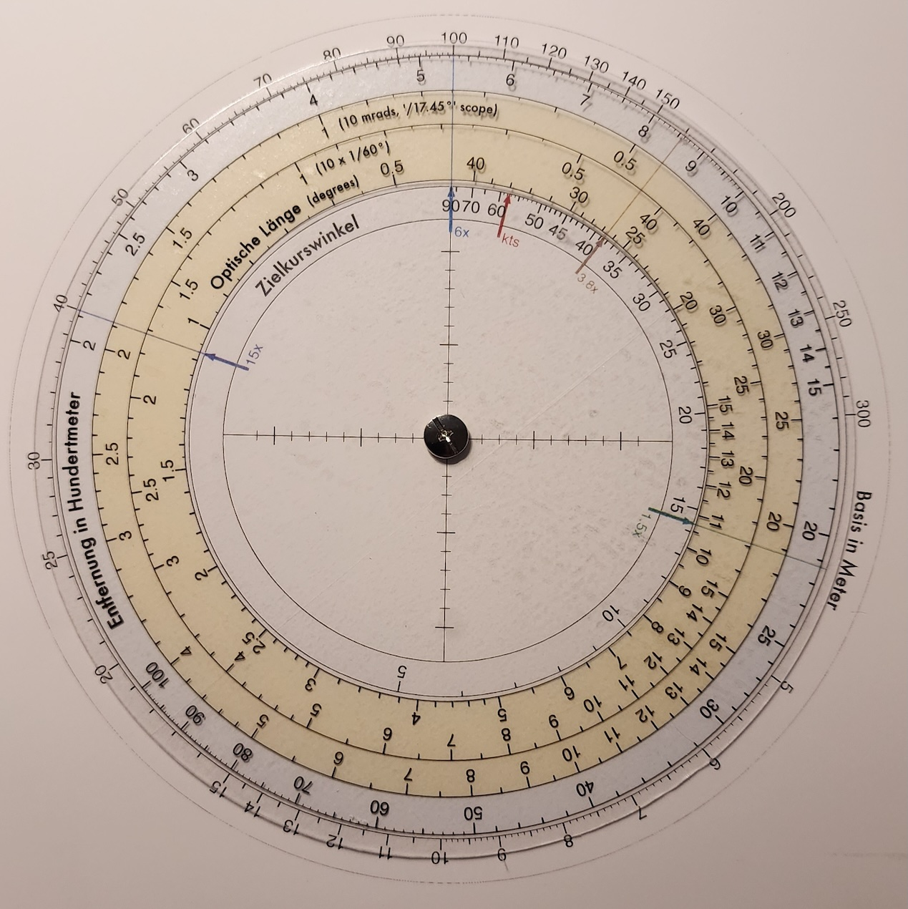

# Enhanced RAOBF Wheel (and Python SVG Generator)



## Introduction
In submarine simulations such as the Silent Hunter series, UBOAT, and Wolfpack, there are many ways available to make determinations of ship distance, speed, and angle on bow (AOB), which are parameters necessary for setting up a good torpedo solution in the TDC, which include:

* Visual estimation - most historically accurate method used by sub commanders, but requires months of training and experience to get right.
* Lookup tables for vertical heights and horizontal lengths - also historically valid method, on scopes that have reticles (which attack periscopes do, but UZO's and binoculars typically did not)
* Mathematical equations
* Built-in TDC measuring tools (in the UBOAT game)
* RAOBF wheel - historically supported in limited time frames

The RAOBF wheel is a handy way to perform multiple calculations (distance, AOB, and speed) using one tool, and mods have been made for games like Silent Hunter and UBOAT to provide a pop-up tool to make these calculations.  However, this tool relies on consistent scope reticles, so the mod often comes with its own reticles built-in overlayed on top of the periscope view.

This project aims to provide a way to create a physical, circular slide rule calculator to perform these lookups quickly using the standard periscope reticles in the game, with a single tool and not having to click or drag multiple overlays, and handy at the player's side.  It needs to have all the possible scales encountered in popular subsim games, both vanilla or when using mods/megamods.  The largest variable in this regard is the vertical reticle scale, which can be either on a /16° or /17.45° (millirads or mrads for short) scales, and the horizontal reticle is often in degrees.  So these three possible scales need to be provided in order to avoid having to perform conversions, to look up the optical length ("optische länge").

Scopes can have a variety of zoom levels.  Historically, most periscopes come with 1.5x and 6x zoom levels.  The UBOAT game uses these zoom levels with the "Realistic" periscope mode, but defaults to an "Extended" periscope mode with three zoom levels: 1.5x, 3.8x, and 15x.  It is necessary to index the optical length to the correct zoom level to determine the correct distances of a ship, so all five zoom level possibilities are marked on this RAOBF with indexing arrows and hairlines.  There is also an indexing arrow for ship speed (in knots) on the AOB scale.

## Components of the RAOBF Wheel
This RAOBF wheel comes in two components: the base and the rotor.  The base is fixed while the rotor is overlayed on top of the base layer and rotates freely to find the desired solutions.  The base can be printed on an opaque sticker sheet and placed on a rigid board, and the rotor should be printed on a transparent sticker sheet and placed on a semi-rigid transparent sheet (or just printed straight to a transparent sheet that can go through a laser or inkjet printer), cut into a circular shape, and held in the middle by an eyelet or "Chicago" screw that allows the rotor wheel to rotate freely.

Multiple SVG and PDF files are supplied in this project for printing the wheel components.  The PDF files are scaled by 89% to best fit my needs.  The file list are:

* raobf_composite - this is a composite of both the base and rotator wheel, mostly for testing the output layout during development of the Python script.
* raobf_base - the base, non-rotating portion of the RAOBF wheel and includes the outer ship height/length scale and inner AOB scale.
* raobf_rotor - the rotating portion of the RAOBF wheel which contains the distance and three optical length scales.
* raobf_rotor_reverse - same as 'raobf_rotor' but in reverse; I found that the rotor looks better when the sticker is placed on the reverse side so that the obverse looks smooth and crisp.

## Construction
Materials I chose to use on my first iteration of making my wheel:

* 8"x10" white Polystyrene sheet, 2mm (0.08").  Between 1 to 2mm should work fine.
* Printable vinyl sticker paper, matte white
* Clear PET sheet, 0.5mm
* Printable glossy clear sticker paper
* M5x4mm Chigaco rivets with M4x3mm screws

Helpful tools include a circle cutter, paper cutter, utility knife, and hole punch or electric drill.

# Python script

If desired, the Python script used to generate these SVGs is included in case you want to modify/customize the RAOBF wheel to your liking.

Run the generator from the project directory:

```bash
python3 raobf_generator.py
```

This writes the combined wheel artwork:

- `raobf_base.svg`
- `raobf_rotor.svg`
- `raobf_rotor_reverse.svg`
- `raobf_composite.svg`

